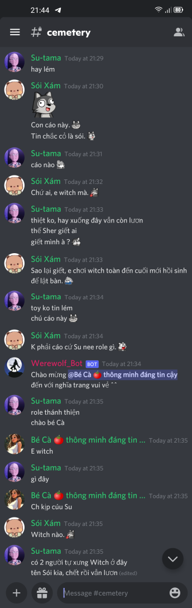

# DNH Werewolf bot (Bot Ma Sói, Thỏ và Sói).
This is a Discord bot for hosting Werewolf game (Ma Sói, Thỏ và Sói). This bot is created and contributed by [DNH members](https://daynhauhoc.com/)

The game will automatically run without a human hoster. More fun!

Original making for Vietnamese player but able to port to any language.

# Setup running environment
Require python >= 3.9
Please note that this repo use Python 3.9 features, so it cannot run on python3.7

Install dependency packages:
```
python3.9 -m pip install -r requirements.txt
```

It's also possible to use `pyenv` if you want to install this independently.  

## Setup .env file
`cp .env.example .env`

Change the fill in the Mandatory fields:
```s
# Mandatory fields
BOT_PREFIX=!         =====> For use command in game like `!join` `!vote`
BOT_NAME=EXAMPLE_BOT   =====> Your bot name, not important
GAME_CATEGORY=GAME     =====> The bot will create a new Category channel in your discord server

DISCORD_TOKEN=ODgx**********************.YSsNGw.ya5O**********************.   ===> Replace this by your own Bot token, generated in https://discord.com/developers/applications/<your_bot_id>/oauth2/general 
DISCORD_DEPLOY_SERVER_ID=881**************     ====> right click on your Discord server and copy the server id.
```


Right Click to copy ServerID:


# Deployment
## Create and add Bot to Discord server
Follow guide to create a new Discord bot and how to add it into your Discord server: https://discordpy.readthedocs.io/en/stable/discord.html

Note: You may need Priviledged Gateway Intents permissions to get the bot work properly due to Discord bug


You need to set bot's permission to allow it to create channel and run game.

In OAuth2 tab, choose bot in Scopes, then choose Adminstrator permission.


## Run bot
Simply run:
```bash
python3.9 bot.py
```
The bot should connect to your Discord server and online:


## Create Admin and Members roles
You MUST create these `Admin` role and `Members` role to play the game.

- Admin role: 
    - User with Admin role can use super command to control the bot. The super commands start with prefix `f_`. Eg: `f_join`, `f_create`, `f_delete`.
You can see list of available commands in [label](commands/command.py) or [label](json/command_info.json). 
    - It's not neccessary to have Admin as a player in game.
    - Admin role can view all game channels including private and public channels.
- Members role: Only user with Members role can join and play a game. You MUST assign this role to users who you allow them to play. This task only needs to be done once every user.

Note that you do not need to provide Admin and Members any permission. The bot will provide proper permission for them under GAME_CATEGORY.

Follow this guide to create and assign roles: https://www.howtogeek.com/809671/how-to-add-assign-roles-discord/


## Create GAME_CATEGORY
Assign you as `Admin` role.
Then run this command:
`!fcreate @bot_name` where @bot_name tag your bot display name in your server


if your bot can read the message, then it will automatically create a new category channel like:


If you want to be a normal player, you can safely remove your Admin role now and enjoy the game.

## Useful commands:
```s
!version  
!help
!help cmd vote
!help role cupid
```


# Game story

[Vietnamese version](STORY_VN.md)

English version: TODO

You can custom langauge under  [./json](json) directory.
- [./json/command_info.json](json/command_info.json) for command text
- [./json/role_info.json](json/role_info.json) for role text

# Gameplay

User can join game via `!join` command or `!f_join` by Admin:


Then players vote to start game via `!start` command.
After if the votes are greater than half of players, the game will be started:


Each player will have a personal channel, where they can cast spell or sleep :D


Players can discuss, `!vote` for werewolf.


Player who is killed by werewolf/witch or is voted to die will be sent to cemetery channel:



But don't worry, you have chance to reborn :D (witch,zombie roles)

The game includes 2 phases every game day time: 

- Day phase: You all can chat in gameplay channel
- Night phase: Werewolf can bite, Guard can protect others or Seer can reveal fox/werewolf...

The game will be ended if all werewolves are eliminated (villager win) or number of werewolves greater or equal number of villagers (werewolves win).


Leaderboard saves endgame result every game.

Enjoy!

# Test
`python3 test.py`

Sample successful output:
```s
successfully loaded json/command_info.json
successfully loaded json/text_template.json
successfully loaded json/role_info.json
reset_game_state

# Code standard
We apply Autopep8 for this project.
Please run `./format.sh` before creating new PR.


$$$$$$$$$$$$$$$$$$$$$$$$$$$$$$$$$$$$$$$$$$$$$$$$$$$$$$$$$$$$$$$$$$$$$$$$$$$$$$$$$$$$$$$$$$$$$$$$$$$$$$$$$$$$$$$$$$$$$$$$$$$$$$$$$$$$$$$$$$$$$$$$$$$$$$
====== Begin test case at testcases/case-witch-reborn-wolf.json =====
...
<Many lines hidden here>
...
reset_game_state
#lobby: Trò chơi đã kết thúc.
gameplay created!
====== End test case =====


FINISH ALL TEST CASES SUCCESSFULLY
```

Tips: you can reduce the TEST_THREAD_DELAY_TIME for faster run

# How to run bot on free deployment service

As usual, free deployment services have certain limitations, typically after a period of inactivity, your bot may go to sleep and all data will be lost.

To address this issue, please follow these steps:

1. Install necessary packages in `web/requirements.txt`
2. Use the `keep_alive()` function in `bot.py`. Now we have our website running together.
3. Link your web URL to UptimeRobot (or anything related), please see below references.
https://uptimerobot.com/
https://dev.to/12944qwerty/hosting-a-discord-py-bot-with-repl-it-3l5a

Explanation: Your bot will be alive because the monitoring services request(ping) every 5-10 minutes and keeps our website running up.

Alternatives: Some deployment services may block request from UptimeRobot, please consider others website:
https://www.fastcron.com/
https://cron-job.org/en/
https://uptime.com/
https://uptime-monitor.io/

# Known issue

## Library bug
A library bug while adding member to `gameplay` channel if using `discord.py==2.2.2`

Prefer to use `discord.py==1.7.3`

# Game Rules
## Vietnamese
[STORY_VN.md](STORY_VN.md)

# Contact
It's open source and free to use Discord bot.

Don't hesitate to contact us for guiding setup.
Discord chat group: https://discord.gg/ceJAgPEMCw